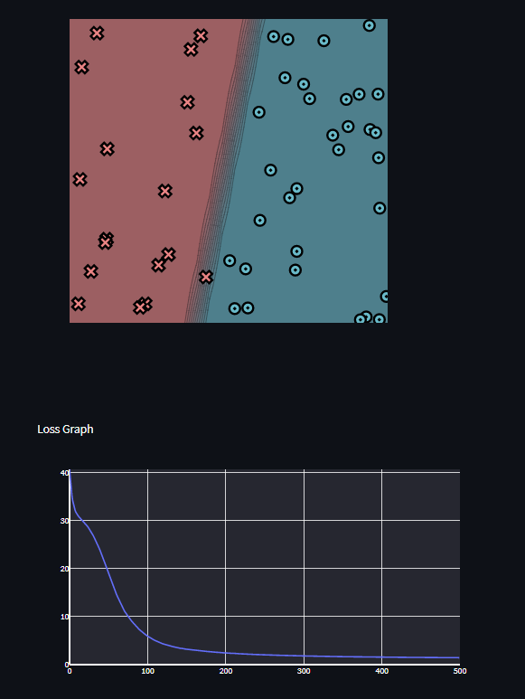
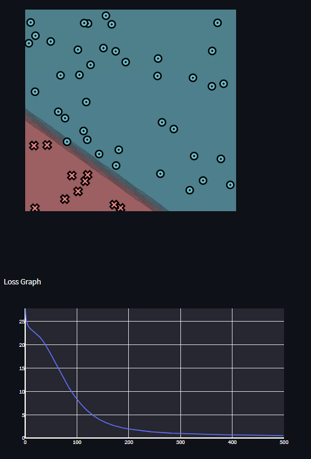
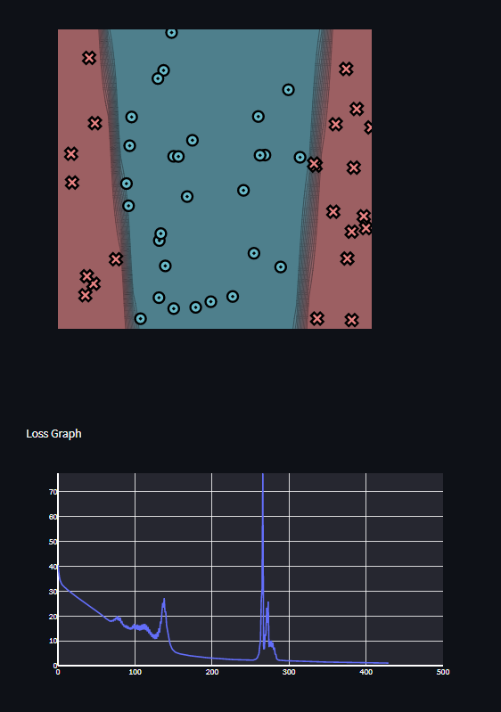
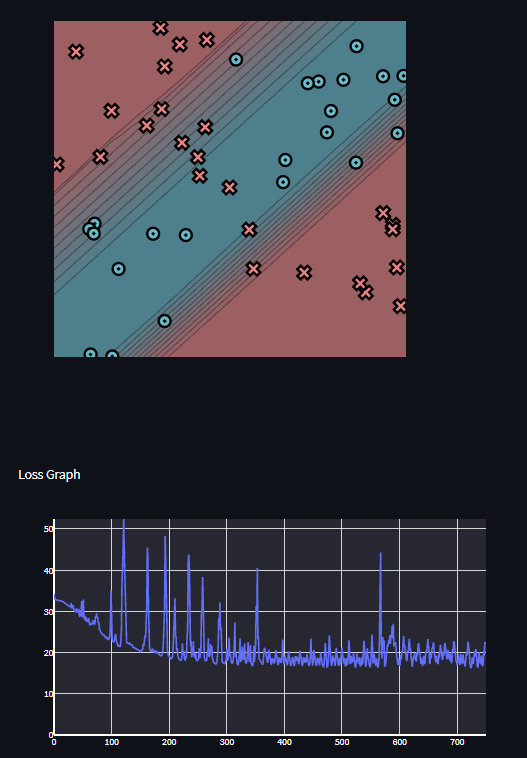

# MiniTorch Module 2

* Docs: https://minitorch.github.io/

* Overview: https://minitorch.github.io/module2.html

This assignment requires the following files from the previous assignments.

        minitorch/operators.py minitorch/module.py tests/test_module.py tests/test_operators.py project/run_manual.py

# Model Test

## Simple

## Diag

## Split

## Xor

